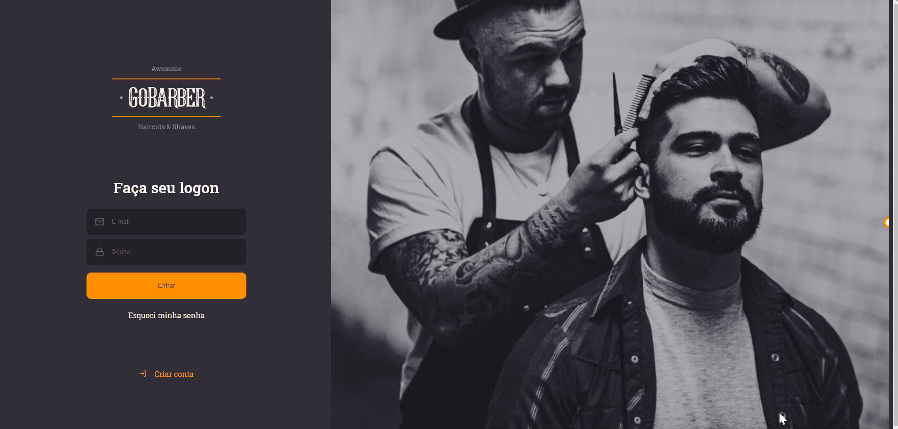

<h1 align="center">
  
</h1>

<h3 align="center">
  ReactJS App for GoBarber
</h3>

<p align="center">Schedule Haircuts & Shaves services</p>

<p align="center">
  

  <a href="https://www.linkedin.com/in/arllain/" target="_blank" rel="noopener noreferrer">
    
  </a>

  

  <a href="https://github.com/arllain/gobarber-web/commits/master">
    
  </a>

  <a href="https://github.com/arllain/gobarber-api/issues">
    
  </a>

  
</p>

<p align="center">
  <a href="#%EF%B8%8F-about-the-project">About</a>&nbsp;&nbsp;&nbsp;|&nbsp;&nbsp;&nbsp;
  <a href="#-technologies">Technologies</a>&nbsp;&nbsp;&nbsp;|&nbsp;&nbsp;&nbsp;
  <a href="#-getting-started">Getting started</a>&nbsp;&nbsp;&nbsp;|&nbsp;&nbsp;&nbsp;
  <a href="#-license">License</a>
</p>

<p align="center">
  
</p>

## 🧐 About

This is the web app for GoBarber.

To see the **api**, click here: [GoBarber Rest API](https://github.com/arllain/gobarber-api)</br>
To see the **mobile client**, click here: [GoBarber Mobile](https://github.com/arllain/gobarber-mobile)

## 🚀 Technologies

Technologies that I used to develop this web client

- [ReactJS](https://reactjs.org/)
- [TypeScript](https://www.typescriptlang.org/)
- [UnForm](https://unform.dev/)
- [Axios](https://github.com/axios/axios)
- [Date-fns](https://date-fns.org/)
- [Polished](https://github.com/styled-components/polished)
- [React Icons](https://react-icons.github.io/react-icons/#/)
- [Styled Components](https://styled-components.com/)
- [uuid v4](https://github.com/thenativeweb/uuidv4/)
- [Yup](https://github.com/jquense/yup)
- [Eslint](https://eslint.org/)
- [Prettier](https://prettier.io/)
- [EditorConfig](https://editorconfig.org/)
- [Testing Library](https://testing-library.com/)
- [React Hooks Testing Library](https://react-hooks-testing-library.com/)

## 💻 Getting started

### Requirements

- Please have this application's [API](https://github.com/arllain/gobarber-api) running

**Clone the project and access the folder**

```bash
$ git clone https://github.com/arllain/gobarber-web.git && cd gobarber-api
```

**Follow the steps below**

```bash
# Install the dependencies
$ yarn

# Be sure that the file 'src/services/api.ts' has the IP of your API
# Start the client
$ yarn start

```

## 📝 License

This project is licensed under the MIT License - see the [LICENSE](LICENSE) file for details.

---

Made with 💜 by Arllain 👋 [See my linkedin](https://www.linkedin.com/in/arllain/)
